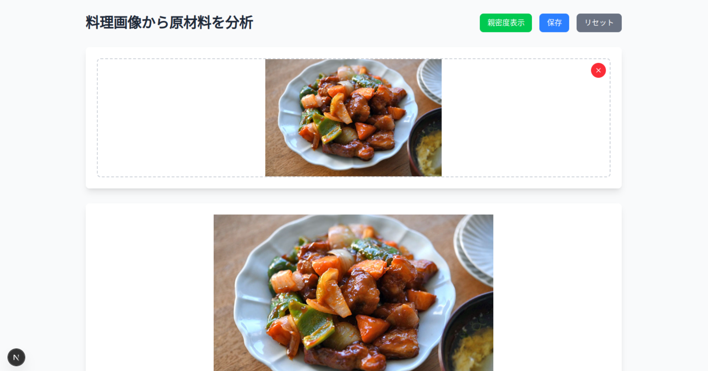
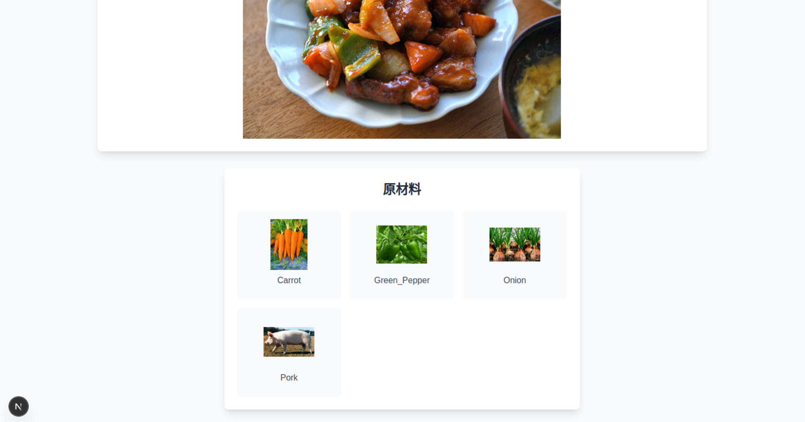
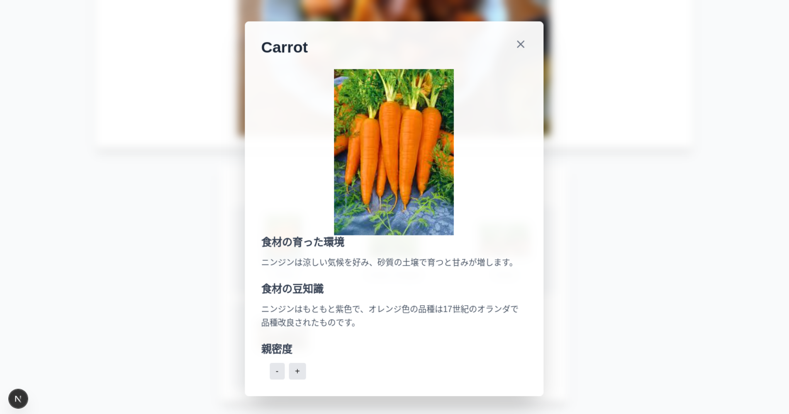

# 食材認識アプリ (Food Ingredient Recognition App)

食材認識アプリは、AI（GPT-4o）を活用して料理画像から使用されている食材を自動的に認識し、それぞれの食材に関する情報を提供するウェブアプリケーションです。





## 機能 (Features)

- **料理画像の分析**: 料理の写真をアップロードすると、AIが料理名と使用されている食材を自動的に認識します
- **食材情報の表示**: 認識された各食材について、育った環境や豆知識などの詳細情報を表示します
- **食材との親密度**: 使用した食材との「親密度」を記録し、自分がよく使う食材を把握できます
- **直感的なUI**: ドラッグ＆ドロップによる画像アップロードや、視覚的に分かりやすいインターフェース

## 技術スタック (Tech Stack)

### フロントエンド (Frontend)
- **Next.js**: Reactベースのフレームワーク
- **TypeScript**: 型安全なJavaScript
- **Tailwind CSS**: ユーティリティファーストのCSSフレームワーク

### バックエンド (Backend)
- **FastAPI**: 高性能なPythonウェブフレームワーク
- **OpenAI API**: GPT-4oを使用した画像分析と食材情報の生成
- **Python**: バックエンドロジックの実装

## セットアップ方法 (Setup)

### 前提条件 (Prerequisites)
- Node.js (v18以上)
- Python (v3.9以上)
- OpenAI APIキー

### バックエンドのセットアップ (Backend Setup)

1. バックエンドディレクトリに移動します:
   ```bash
   cd backend
   ```

2. 依存関係をインストールします（Poetryを使用する場合）:   
   pipを使用する場合:
   ```bash
   pip install -r requirements.txt
   ```

3. `.env`ファイルを作成し、OpenAI APIキーを設定します:
   ```
   OPENAI_API_KEY=your_openai_api_key_here
   ```

4. バックエンドサーバーを起動します:
   ```bash
   uvicorn app:app --reload
   ```

### フロントエンドのセットアップ (Frontend Setup)

1. フロントエンドディレクトリに移動します:
   ```bash
   cd frontend
   ```

2. 依存関係をインストールします:
   ```bash
   npm install
   # または
   yarn install
   ```

3. 開発サーバーを起動します:
   ```bash
   npm run dev
   # または
   yarn dev
   ```

4. ブラウザで [http://localhost:3000](http://localhost:3000) を開きます

## 使い方 (Usage)

1. アプリケーションのホーム画面で、「クリックしてアップロード」ボタンをクリックするか、画像をドラッグ＆ドロップします
2. AIが画像を分析し、認識された食材のリストを表示します
3. 食材カードをクリックすると、その食材に関する詳細情報が表示されます
4. 「親密度」ボタンを使って、各食材との親密度を調整できます
5. 「保存」ボタンをクリックすると、現在の食材との親密度が更新されます
6. 「親密度表示」ボタンをクリックすると、すべての食材との親密度が一覧表示されます

## プロジェクト構造 (Project Structure)

```
2025_AI_hackathon/
├── backend/                # バックエンドコード
│   ├── app.py              # FastAPIアプリケーション
│   ├── dish_estimator.py   # 料理分析ロジック
│   └── routes/             # APIルート
│       └── chat.py         # チャットAPI
├── frontend/               # フロントエンドコード
│   ├── public/             # 静的ファイル
│   │   └── images/         # 食材画像
│   └── src/                # ソースコード
│       ├── app/            # Next.jsアプリ
│       │   ├── api/        # APIルート
│       │   └── page.tsx    # メインページ
│       └── components/     # Reactコンポーネント
└── README.md               # プロジェクト説明
```

## ライセンス (License)

このプロジェクトはApache Licenseの下で公開されています。詳細は[LICENSE](LICENSE)ファイルを参照してください。

## 参考 (References)

- [OpenAI](https://openai.com/) - GPT-4oモデルの提供
- [Next.js](https://nextjs.org/) - フロントエンドフレームワーク
- [FastAPI](https://fastapi.tiangolo.com/) - バックエンドフレームワーク
- [Tailwind CSS](https://tailwindcss.com/) - CSSフレームワーク
